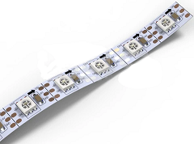
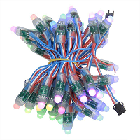

# Plugin wled

Description
===

Plugin permettant de contrôler des led adressables via le contrôleur WLED.

Mais tout d'abord il faut préciser ce que sont les led adressables qu' on trouve sous forme 

- de ruban,

- de "guirlande" (parfait pour un éclairage extérieur de Noël en mettant alimentation et contrôleur dans un coffret étanche)

- ou de matrice.
 
Ce sont des led où chaque led (ou plus rarement groupe de 2 ou 3 leds) possède son petit contrôleur qui permet de la commander individuellement.
On peut donc faire de très jolis effets puisque le côntroleur va pouvoir commander l'allumage, la luminosité ou la couleur de chaque led.

On peut les contrôler avec par exemple un contrôleur WifI comme le SP108E qu’on trouve sur Amazon, eBay, Aliexpress, … pour lequel il existe des app Android et IOS.

Si j’ai correctement lu la doc des différents plugins Jeedom que j’ai trouvé aucun ne gère ce type de contrôleur (mais j’ai peut-être mal lu).

Mais ce qui m'a spécialement intéressé c'est qu'il existe un fantastique contrôleur Wifi qu'on peut implanter sur un ESP8266 ou ESP32 (par exemple un Wemos ou un NodeMCU) qui permet de commander ces leds.

Sachant que ce contrôleur possède une API très riche qui permet de communiquer avec lui par des requêtes JSON ou HTTP, j'ai décidé de faire un plugin pour interfacer ce contrôleur avec Jeedom

Bon assez de généralités. Pour débuter il vous faut

- des leds par exemple un ruban ou une guirlande avec des leds WS2812B ou WS2811 ou SK6812 ou WS2801 ou APA102
- un ESP8266 ou ESP32 avec le programme WLED téléchargé dessus et configuré pour votre réseau Wifi et vos leds. Je ne m'étendrai pas sur comment faire, il existe de multiples tutos et vidéos YouTube qui expliquent cela
- en option plutôt qu'un circuit "nu" ou bricolé sur une plaque je me permet de vous recommander le contrôleur Dig Uno (et son grand frère Dig Quad qui peut contrôler 4 rubans) de Quinled https://quinled.info/2018/09/15/quinled-dig-uno/ il offre plusieurs avantages : il y a un fusible protecteur, il gère les tensions 5V et 12V, il y a un level shifter qui permet d'avoir un cable plus long entre le contrôleur et la première led sans que le signal ne se détériore,...

Ce contrôleur peut être acheté tout fait, voir https://quinled.info/2020/02/11/quinled-dig-uno-pre-assembled-available/ ou monté, on peut dans ce cas acheter juste le circuit imprimé chez DirtyPCB ou PCBWay, voir https://quinled.info/2020/05/08/quinled-dig-uno-hardware-guide-2/

Je vous conseille avant de vous lancer dans le plugin d'installer l'application WLED sur votre smartphone Android ou IOS et de vérifier que tout est OK que vous arrivez bien à commander vos leds. Cela vous permettra ausi de connaître l'adresse IP de votre ruban sur votre réseau local.

Note : le plugin fonctionne en local sur votre réseau Wifi. il est totalement indépendant du web.

Configuration du plugin
===

Création des équipements
===

